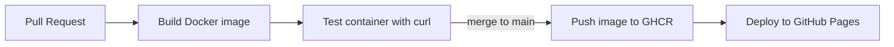

# سما | Weather App with Docker & CI/CD

تطبيق طقس بالعربي، لون الخلفية فيه بيتغير حسب الجو الحقيقي في المدينة (نهار، ليل، غيم، مطر، ثلج، عاصفة).
الهدف من المشروع تطبيق عملي على **DevOps**: الـ containerization، والـ CI/CD، والنشر الأوتوماتيك.

🔗 **الموقع:** https://saradrwish.github.io/weather-app-devops/

## Pipeline



| المرحلة | بتحصل إمتى | بتعمل إيه |
|---|---|---|
| **CI** | مع كل Pull Request وكل push على `main` | تبني الـ image، تشغل الـ container، وتتأكد إن كل الملفات بترد |
| **Registry** | بعد الـ merge على `main` | ترفع الـ image على GitHub Container Registry بتاجين: `latest` و الـ commit SHA |
| **CD** | بعد ما الـ CI ينجح بس | تنشر الموقع على GitHub Pages |

## Tech Stack

- **Frontend:** HTML, CSS, JavaScript (من غير frameworks)
- **Container:** Docker, Nginx (Alpine)
- **CI/CD:** GitHub Actions
- **Registry:** GitHub Container Registry (ghcr.io)
- **Hosting:** GitHub Pages
- **API:** [Open-Meteo](https://open-meteo.com/) (مجاني ومن غير API key)

## التشغيل على جهازك

```bash
# بناء الـ image
docker build -t weather-app .

# تشغيل الـ container
docker run -d -p 8080:80 --name weather weather-app

# افتح http://localhost:8080
```

أو شغّل النسخة المنشورة من الـ registry مباشرة:

```bash
docker pull ghcr.io/saradrwish/weather-app:latest
docker run -d -p 8080:80 ghcr.io/saradrwish/weather-app:latest
```

## هيكل المشروع

```
weather-app-devops/
├── .github/workflows/ci-cd.yml   # الـ pipeline
├── Dockerfile                    # وصفة بناء الـ image
├── .dockerignore                 # ملفات مش داخلة في الـ image
├── index.html
├── style.css
└── app.js
```
